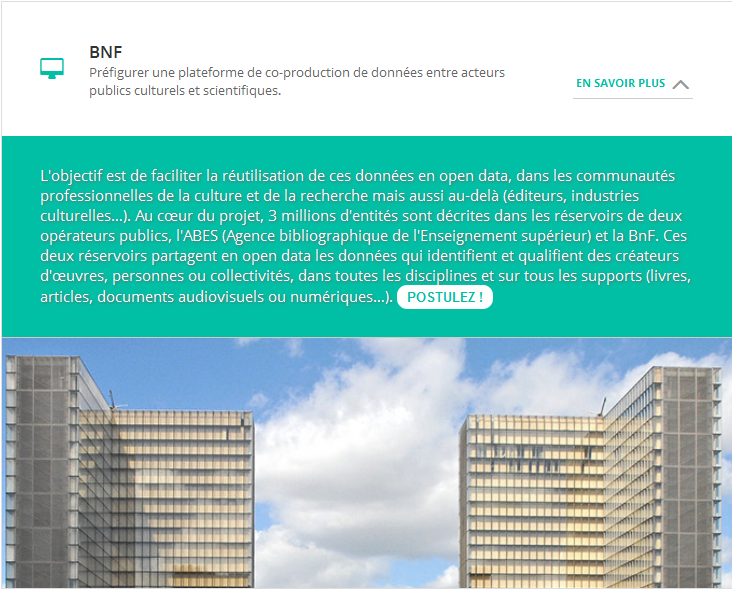
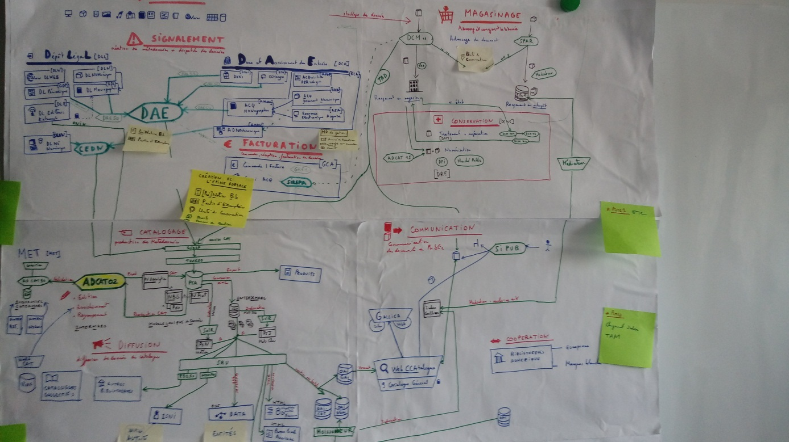
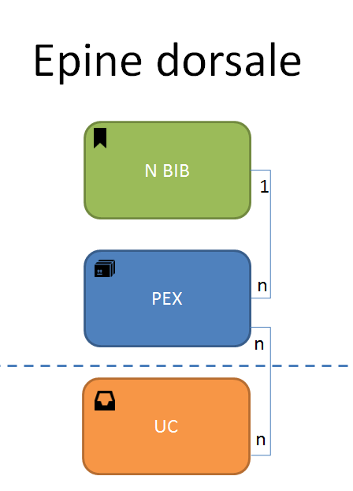

# BIG CAT
#### *Modélisation et Architecture des métadonnées du catalogue*

---


---
### Défi EIG initial

Préfigurer une plateforme de **co-production de données bibliographiques**
qui permette la collaboration
en temps réel avec d'autres institutions productrices de données

---

### Contexte du projet

Ce projet s'inscrit dans une feuille de route de développement à 4 ans

Développement de **pilote MD**: Un nouvel outil de production de métadonnées (notices/entités)

---

* Refonte complète d'une application `ADCAT02` qui permet l'edition de la BDD catalogue
* Modélisation d'une architecture pour ces métadonnées
* Prise en compte des modifications du format
* Proposition d'automatisation de certaines tâches: récupération de données
* Collaboration envisagée avec une institution pour synchroniser les notices

---

### Objectifs:

* permettre l'insertion/edition simple ou multiple/ manuel et automatique en temps réel
* suivre l'historique et la provenance d'une notice
* raccourcir les temps d'indexation et de publication dans l'interface catalogue
* controler la qualité et la granularité de la production des données
* synchronisation/enrichissement avec d'autres institutions

---

### Prise en compte:

* des nouveaux besoins en terme de catalogage [Feuille de route]()
* de l'évolution du format interne de description des métadonnées, [Atelier InterMarcNG]()
* des questions techniques soulevées par ces besoins, et entretiens des experts/praticiens DL/DCO/MET/DSI + [Documentation technique]()
* des modes de production, de stockage et d'utilisation existant des données de catalogue[Schema CATSI]() + [Modele Logique de Données]() + [RIM]()

---

### Choix technologiques:

---

#### Stockage des données
  - base de données orientée sur une notice une notice = un document
  - applatissement du format Intermarc (4 niveaux => clé, valeur(s?))
  - gestion des documents comme des ensembles et des listes d'items dans les sous-documents embarqués
  - pas de schéma pour des données diverses (+ 200 types de documents, des centaines de règles)
> Base de données Mongo (NOSQL orienté document)
---

#### Traitement

  - éviter les resolutions couteuses de tuples creux et les jointures complexes
  - gestion souple des références (relations entre document)
  - conserver la séparation entre les données et le controle du format
  - parallélisation des tâches (aggregation, dénombrement,mise en relation)

> Python + MongoDb

---

#### Architecture

* Environnement distribué en grappe de serveurs avec replication et redondance
  - favoriser la stabilité et la réactivité du système

> Mongo Deploy Shard :
blockage technique sur la mise en place en local d'une telle archi

---

* Format JSON (Conversion depuis le XML):
  - plus compact, moins de place en mémoire et simplification à 1 niveau d'un format
  à 3 niveaux + relations
> script python XML > JSON

---

* Développement d'un service SOAP avec une API REST pour l'interrogation et l'édition de la BDD:
  - protocole moderne et souple sur le modèle SRU
  - facile à adapter aux différents besoins
  - interface web indépendante

> flask + django_rest ?


---

## Données, métadonnées et flux

---

### Flux des métadonnées

Toute l'activité de catalogage repose sur une base de données PCA dont le schéma est très complexe (multiples interdépendances)

Fonctionnement en silo des entrées sorties avec pour centre nerveux la base de données.

---
Une vue simplifiée

```
x Entrées ==> BDD Catalogue ==> x Sorties
                  ^
                  |
        RIM <=> ADCAT O2
```
---


---
## De multiples entrées

* Dépot légal:
  - flux automatique (ONIX)
  - flux manuel (DAE)
* Acquisition:
  - flux automatique (ONIX)
  - flux manuel (DAE)
* Coopération / Numérisation autres institutions:
  - Versement dans la base (DPI)

---

## Une chaine de traitement centrale

- Conversion
- Insertion en base PostgresQL
- Correction/édition/fusion
- Indexation (SolR)
- Conversion XML -> Insertion dans FS -> Indexation (SolR)


---

## De multiples sorties:

* Portail consultation
  - BgF (XML > HTML)
  - presse locale ancienne(XML > HTML)
  - Nouveautés Editeurs (XML> HTML)
  - Interface catalogue (WebCCA) (XML> OAI> WebCCA)

---

* SI Spécifique/Tiers
  - Infos Dépot Legal (ONIX > XML)
  - Entrepot OAI (XML)
  - autres bibliothèques (XML)
  - data.bnf.fr (XML> RDF)
  - Produits (dump SQL> files)
  - ISNI  (XML[Atom]> BDD [OCLC])

---

* Via une application ou manuel:
  - VIAF (WorldCat)
  - ISNI

---

### Contexte

---
#### Une longue tradition  de l'ingénierie documentaire:

Les données bibliographiques bénéficient d'une très longue tradition
de catalogage et de référencement qui justifient leur spécificité

---
  * format de catalogage interne (Intermarc)
  * protocole d'échange spécifique (SRU, Z39.50, AtomPub, ONIX, OAI)
  * format des données multiples (XML, RDF, HTML, fichiers)
  * contexte normatif international (normes ISO, AFNOR etc...)

> Très différent des contextes de développement habituel
(Veille, Recherche, BI)

---

#### Contexte spécifique, enjeux spécifiques

Les données bibliographiques en ce qu'elle décrivent des ressources documentaires, patrimoniales et culturelles ont des enjeux spécifiques propre à leur contexte de production et d'usage

---

  * Qualité, conservation, pérennité et réutiliabilité des données
  * Fonctionnement en silos centré autour d'un catalogue (Référence doc)
  * Spécificité des données: descriptives d'objet et d'entité

---

  * Evolution du métier du catalogueur (+ d'autonomie)
  * Mise en tension du métier d'informaticien documentaire (fonction support, évolution des technologies et des usages)

---

#### Divers métiers autour des métadonnées:

  - éditeurs et distributeurs,
  - conservateurs,
  - archivistes,
  - bibliotécaires,
  - catalogueurs,
  - bibliographes,
  - responsables qualité et normalisation,
  - informaticien GED
  - ...

---

#### Divers usages des métadonnées

Les usages des métadonnées sont presque exclusivement centrés autour de la consultation de ressources

  - académiques (étudiants/chercheurs)
  - professionnels & spécialistes (ex: juristes, métiers d'art)
  - documentalistes, éditeurs, bibliothécaires
  - grand public
  - robots

---

### Des enjeux spécifiques pour chacun des métiers

  - obligation légale et promotion commerciale
  - mise en valeur d'un fond documentaire
  - conservation, pérennisation des ressources
  - accès, circulation et diffusion des ressources documentaires
  - ordre, granularité, fiabilité des descriptions des ressources
  - recensement exhaustif et selection de qualité
  - adaptation des données aux standards et aux normes: générique/spécifique
  - stockage, traitement, accès aux données enjeu transversal de support des enjeux

---

## Données, métadonnées, modèles

---
! Vocabulaire !

`Donnée`:
  * document/ressource
  * unité d'information figée et transmissible

`Métadonnée`:
            * description d'une ressource (notice/entité)
            * donnée descriptive
`Production`:
            * activité de catalogage (production de notices)
            * version déployée et utilisée par son public (vs Test)
`UC`:
* unité de conservation
* unité centrale

---

### Représentation d'une métadonnées d'un point de vue métier

Une métadonnée dans le contexte d'une bibliothèque est donc la **description intellectuelle**
d'une **ressource documentaire**

Mais sa **représentation varie** en fonction du métier

---

L'épine dorsale représente la ressource documentaire (donnée + métadonnée)




---

Une métadonnée peut être vue comme une notice:

* ***Notices BIBliographique*** description d'une ressource

* ***Notices AUTorité*** description d'une entité (personne, lieu, évènement, etc..)

* ***Notices ANAlytique*** ensemble de notices ordonnées autour d'un concept

---

Une notice donc qui décrit une ressource dans un format spécifique controlé:

* Le format d'expression de cette métadonnée est l'**InterMarc**

```

000 00706c0 m 2200027 45a
001 FRBNF310094750000009
008 970701s 1856 frfre b
009 a f
100 .. $3 11887103 $w 0 2b..... $a Nerval $m Gérard de $d 1808-1855 $4 0070
145 .6 $3 11992732 $w .0..b.fre. $a Les |filles du feu $m français $8 20160116PRR1V04
245 1. $a Les |filles du feu $d Texte imprimé $e introduction, Angélique, Sylvie (souvenirs du Valois), Jemmy, Octavie, Isis, Corilla, Emilie, [les chimères] $f par Gérard de Nerval
250 .. $a Nouv. éd.
260 .. $a Paris $c Michel Lévy frères $d 1856
280 .. $a XIX-298 p. $d in-18
295 1. $a Collection Michel Lévy
410 .. $3 34241729 $t Collection Michel Lévy $x 1760-8678 $d 1856
680 6. $a 840 $d 840
690 .. $a VoyIt
690 .. $a FichUnif
917 .. $o CRI $a CG012305950003PE

```

* Un format controlé par des règles de catalogage [Kitcat](kitcat.bnf.fr)
* La métadonnée est ainsi stockée arbre descendant

---
Une métadonnée peut aussi etre représentée comme une **donnée de type texte**
c'est ainsi qu'elle est stockée en base

* Elle est stockée dans une Base de données centrale (dans un colonne texte spécifique)

* Certaines des valeurs sont dupliquées dans d'autres colonnes pour être indexées

---

Cette métadonnée peut aussi etre représentée sous forme de fichier avec un langage à balise plus strict et plus adapté aux conversion dans d'autres formats de décriptions de métadonnées documentaires

La métadonnée prend la forme d'un fichier XML stockée dans un système de  fichiers

---

La métadonnée peut aussi représenter non plus une notice mais une entité
Elle est représenté dans

### Les différents modèles de données

* Modèle descriptif des données (format| grammaire| langue)
* Modèle logique de données (ordre| tri | selection| projection| agregation)
* Modèle conceptuel de données (sens | usage)


> BIG CAT
